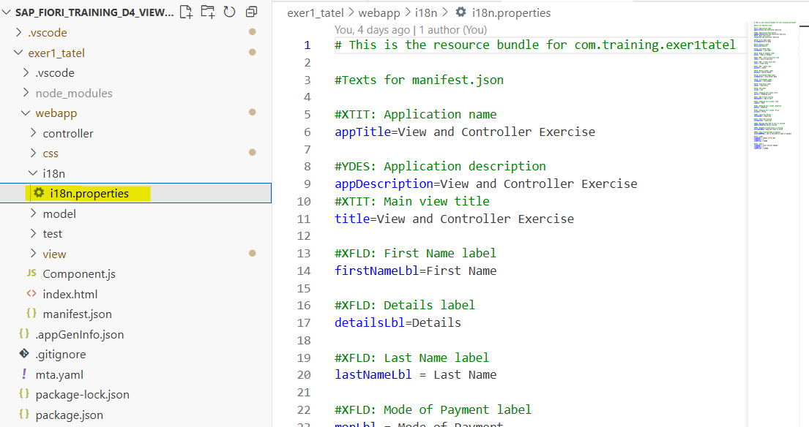
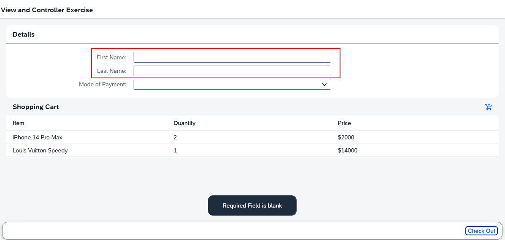
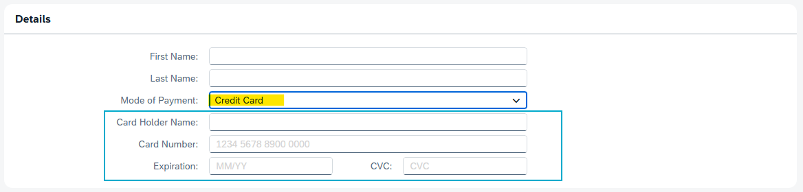
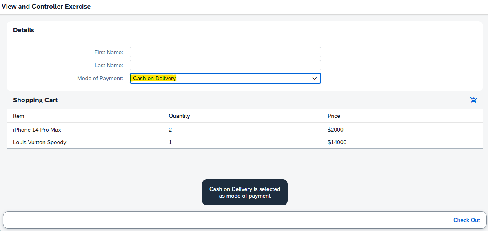
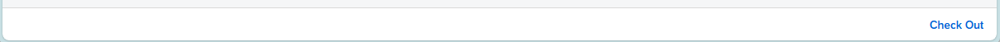
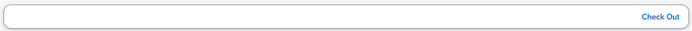

# [SAP Fiori Capability] SAPUI5 Basic Training
## DAY 4 - Views and Controllers Activity

1. Convert the rest of our hardcoded text to i18n
    
    *Showing part of i18n file with the text*

 

2. Add a logic in our check out button that will check if both First Name and Last Name are blank, show an error.
    
    *Upon clicking the Checkout button, if both First Name and Last Name are blank, an error message "Required field is blank" will pop up.*

 

3. Add another new field for Credit Card details in our form. If mode of payment is credit card, this new field is displayed.
    
    *If Credit Card is chosen as Mode of Payment, additional fields will be displayed: Card Holder Name, Card Number, Expiration, and CVC.*

 

4. Add a logic in our event handler onChangeMOP. Show the text of the selected mode of payment in a MessageToast control. 
    
    *Chosen mode of payment is displayed in the MessageToast.*

 

5. Convert our footer from OverflowToolbar to floating toolbar
    
    *BEFORE: Overflow toolbar*
    

    *AFTER: Floating toolbar*
    

