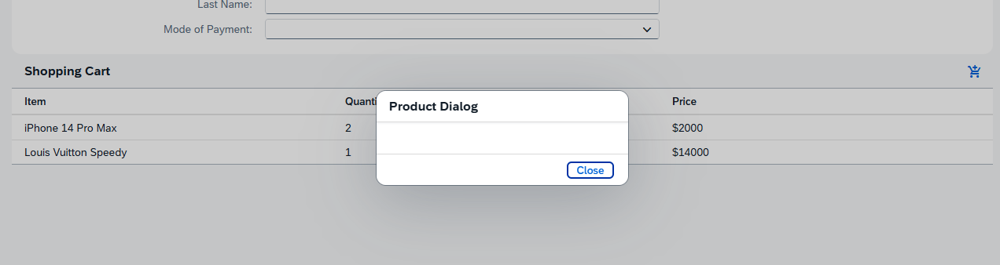
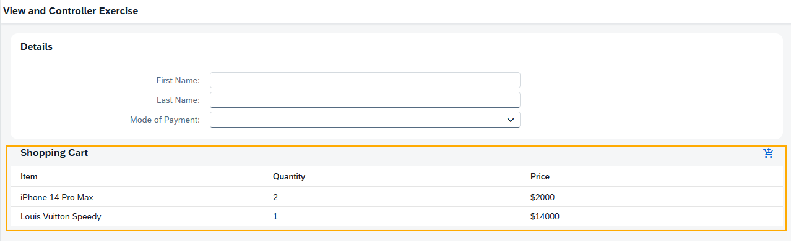
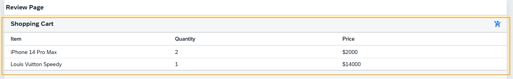
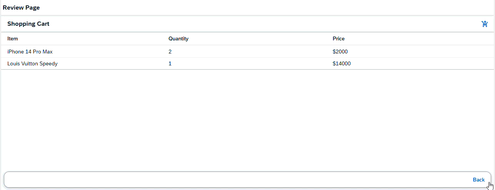

# [SAP Fiori Capability] SAPUI5 Basic Training
## DAY 6 - Fragments & Routes and Navigation Activity

*Continuation from DAY 4 - Views and Controllers Activity.*

### Fragments
* Clicking Add to Cart button, the Product Dialog will be displayed. Clicking the Close button will close the dialog.
    

 

* Shopping Cart fragment is reused for both the main view and review page.
    
    *Main View*

     

    
    *Review Page*

 

### Routes and Navigation

With both First Name and Last Name filled in, clicking the Check Out button will navigate to the Review page.

 

In the Review Page, clicking the Back button will navigate back to the Main View with the input values still displayed.
